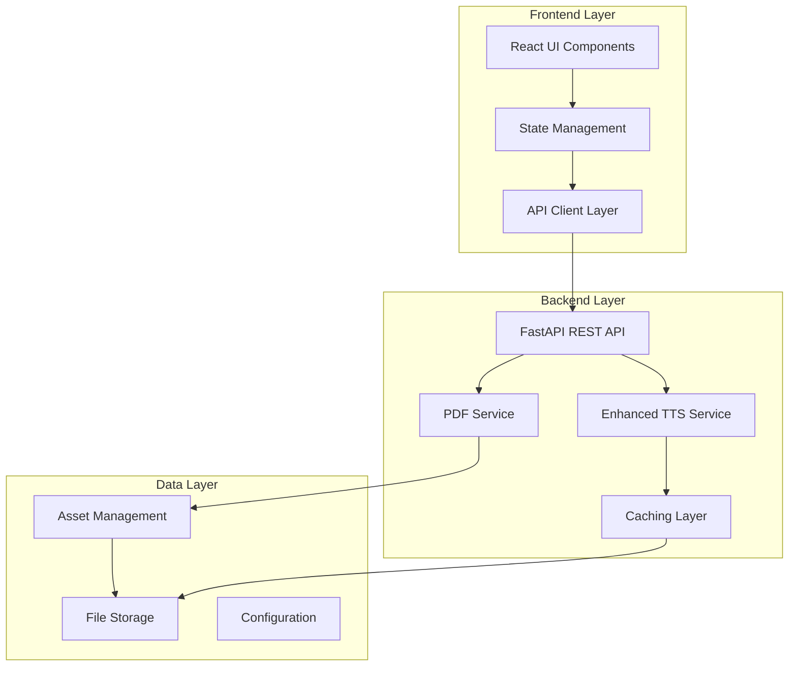

# Design Document

## Overview

Este documento detalha o design da solução para reestruturação do aplicativo de leitura com TTS. A solução aborda os problemas identificados de paginação incorreta de PDFs, melhoria do sistema de TTS com vozes brasileiras naturais, e estabelecimento de uma arquitetura bem estruturada e documentada.

### Problemas Identificados na Análise do Código Atual

1. **Paginação de PDFs**: O sistema atual usa duas abordagens (PDF.js no frontend + backend extractor) que podem causar inconsistências na contagem de páginas
2. **TTS Básico**: Implementação funcional mas com vozes limitadas e experiência robotizada
3. **Estrutura de Código**: Falta documentação, padrões inconsistentes, e interfaces não bem definidas
4. **Comunicação Frontend-Backend**: APIs funcionais mas sem contratos bem definidos

## Architecture

### Arquitetura Geral Proposta



### Princípios de Design

1. **Single Source of Truth**: Backend será autoritativo para paginação de PDFs
2. **Progressive Enhancement**: TTS melhorado mantendo compatibilidade
3. **Clear Contracts**: APIs bem definidas com TypeScript interfaces
4. **Modular Architecture**: Componentes independentes e testáveis
5. **Performance First**: Caching inteligente e lazy loading

## Components and Interfaces

### 1. PDF Processing Service (Backend)

**Responsabilidade**: Processamento autoritativo de PDFs mantendo paginação original

```python
@dataclass
class EnhancedPageContent:
    number: int
    text: str
    formatted_text: str  # Texto formatado para TTS
    images: List[PageImage]
    metadata: PageMetadata
    
@dataclass
class PageMetadata:
    word_count: int
    estimated_reading_time: int  # segundos
    has_headers: bool
    has_lists: bool
    complexity_score: float  # 0-1 para ajustar TTS
```

**Interface API**:
```python
class PDFProcessingService:
    async def extract_with_preservation(self, pdf_path: str) -> PDFResult
    async def get_page_content(self, pdf_id: str, page_num: int) -> EnhancedPageContent
    async def validate_page_count(self, pdf_path: str) -> int
```

### 2. Enhanced TTS Service

**Responsabilidade**: TTS natural com vozes brasileiras de qualidade

```python
@dataclass
class TTSConfig:
    voice_id: str
    speed: float
    pitch: float
    emphasis: bool
    pause_handling: bool
    
@dataclass
class BrazilianVoice:
    id: str
    name: str
    gender: str
    region: str  # "SP", "RJ", "MG", etc.
    naturalness_score: float
    recommended_for: List[str]  # ["narrative", "technical", "casual"]
```

**Interface API**:
```python
class EnhancedTTSService:
    async def generate_natural_audio(self, text: str, config: TTSConfig) -> AudioResult
    async def get_brazilian_voices(self) -> List[BrazilianVoice]
    async def optimize_text_for_speech(self, text: str) -> str
    async def generate_with_emphasis(self, text: str, emphasis_points: List[int]) -> AudioResult
```

### 3. Frontend State Management

**Responsabilidade**: Estado consistente e sincronizado

```typescript
interface AppState {
  document: DocumentState
  audio: AudioState
  ui: UIState
}

interface DocumentState {
  metadata: DocumentMetadata
  pages: PageContent[]
  currentPage: number
  totalPages: number
  loadingState: LoadingState
}

interface AudioState {
  isPlaying: boolean
  currentVoice: BrazilianVoice
  playbackConfig: PlaybackConfig
  currentPosition: AudioPosition
}
```

### 4. API Client Layer

**Responsabilidade**: Comunicação tipada com backend

```typescript
class DocumentAPI {
  async uploadDocument(file: File): Promise<DocumentResult>
  async getPageContent(docId: string, pageNum: number): Promise<PageContent>
  async validateDocument(docId: string): Promise<ValidationResult>
}

class TTSAPI {
  async generateAudio(request: TTSRequest): Promise<AudioResult>
  async getBrazilianVoices(): Promise<BrazilianVoice[]>
  async optimizeTextForSpeech(text: string): Promise<string>
}
```

## Data Models

### Enhanced PDF Processing

```python
class PDFProcessor:
    """Processador autoritativo de PDFs"""
    
    def __init__(self):
        self.page_validator = PageValidator()
        self.text_optimizer = TextOptimizer()
    
    async def process_pdf(self, file_path: str) -> ProcessedPDF:
        # 1. Validar integridade do PDF
        validation = await self.page_validator.validate(file_path)
        
        # 2. Extrair conteúdo preservando paginação original
        pages = await self._extract_pages_with_preservation(file_path)
        
        # 3. Otimizar texto para TTS
        for page in pages:
            page.formatted_text = await self.text_optimizer.optimize_for_speech(page.text)
        
        return ProcessedPDF(
            pages=pages,
            total_pages=len(pages),
            validation_result=validation
        )
```

### Brazilian TTS Enhancement

```python
class BrazilianTTSManager:
    """Gerenciador de vozes brasileiras naturais"""
    
    RECOMMENDED_VOICES = {
        "narrative": ["pt-BR-FranciscaNeural", "pt-BR-AntonioNeural"],
        "technical": ["pt-BR-BrendaNeural", "pt-BR-DonatoNeural"],
        "casual": ["pt-BR-ElzaNeural", "pt-BR-FabioNeural"]
    }
    
    async def get_best_voice_for_content(self, content_type: str, user_preference: str = None) -> BrazilianVoice:
        """Seleciona a melhor voz baseada no tipo de conteúdo"""
        
    async def enhance_speech_naturalness(self, text: str, voice: BrazilianVoice) -> TTSConfig:
        """Otimiza configurações para fala mais natural"""
        
        config = TTSConfig(
            voice_id=voice.id,
            speed=self._calculate_optimal_speed(text),
            pitch=self._adjust_pitch_for_voice(voice),
            emphasis=True,
            pause_handling=True
        )
        
        return config
```

## Error Handling

### Estratégia de Error Handling

1. **PDF Processing Errors**:
   - Fallback para PDF.js se backend falhar
   - Validação de integridade antes do processamento
   - Recovery automático para PDFs corrompidos

2. **TTS Errors**:
   - Fallback para vozes alternativas
   - Retry com configurações simplificadas
   - Cache de áudio para evitar regeneração

3. **Network Errors**:
   - Retry automático com backoff exponencial
   - Offline mode com cache local
   - Graceful degradation de funcionalidades

```typescript
class ErrorHandler {
  async handlePDFError(error: PDFError): Promise<RecoveryAction> {
    switch (error.type) {
      case 'CORRUPTION':
        return this.attemptPDFRepair(error.file)
      case 'PAGINATION_MISMATCH':
        return this.reconcilePagination(error.expected, error.actual)
      case 'EXTRACTION_FAILED':
        return this.fallbackToClientSide(error.file)
    }
  }
  
  async handleTTSError(error: TTSError): Promise<RecoveryAction> {
    switch (error.type) {
      case 'VOICE_UNAVAILABLE':
        return this.selectFallbackVoice(error.requestedVoice)
      case 'GENERATION_FAILED':
        return this.retryWithSimplifiedConfig(error.config)
      case 'NETWORK_ERROR':
        return this.useCachedAudio(error.text)
    }
  }
}
```

## Testing Strategy

### Testes de Unidade

1. **PDF Processing**:
   - Validação de paginação com PDFs de diferentes tamanhos
   - Teste de preservação de formatação
   - Teste de extração de imagens

2. **TTS Service**:
   - Teste de qualidade de vozes brasileiras
   - Validação de naturalidade de fala
   - Performance de geração de áudio

3. **Frontend Components**:
   - Teste de sincronização de estado
   - Validação de navegação de páginas
   - Teste de controles de áudio

### Testes de Integração

1. **End-to-End PDF Processing**:
   - Upload → Processamento → Exibição
   - Validação de contagem de páginas
   - Teste com PDFs de diferentes formatos

2. **TTS Integration**:
   - Texto → Áudio → Reprodução
   - Sincronização com navegação de páginas
   - Teste de vozes brasileiras

### Testes de Performance

1. **PDF Loading**:
   - Tempo de processamento para PDFs grandes (>200 páginas)
   - Uso de memória durante processamento
   - Lazy loading de páginas

2. **TTS Generation**:
   - Tempo de geração de áudio
   - Eficiência do cache
   - Qualidade de áudio vs. velocidade

## Implementation Phases

### Fase 1: Correção da Paginação de PDFs
- Refatorar PDF processing para ser autoritativo no backend
- Implementar validação de integridade de páginas
- Criar testes para diferentes tipos de PDF

### Fase 2: Enhancement do TTS
- Implementar seleção inteligente de vozes brasileiras
- Adicionar otimização de texto para fala natural
- Implementar controles avançados de reprodução

### Fase 3: Estruturação do Código
- Criar documentação completa da arquitetura
- Implementar interfaces TypeScript para todas as APIs
- Adicionar testes unitários e de integração

### Fase 4: Otimização e Polish
- Implementar caching inteligente
- Otimizar performance para documentos grandes
- Adicionar métricas e monitoramento

## Configuration Management

### Variáveis de Ambiente

```bash
# Backend Configuration
PDF_PROCESSING_MODE=enhanced  # enhanced|basic
TTS_CACHE_SIZE=100
TTS_VOICE_PREFERENCE=brazilian
MAX_PDF_SIZE_MB=100

# Frontend Configuration
REACT_APP_API_BASE_URL=http://localhost:8000
REACT_APP_TTS_ENABLED=true
REACT_APP_OFFLINE_MODE=false
```

### Configuração de Vozes TTS

```json
{
  "tts_config": {
    "brazilian_voices": {
      "primary": "pt-BR-FranciscaNeural",
      "alternatives": ["pt-BR-AntonioNeural", "pt-BR-BrendaNeural"],
      "fallback": "pt-BR-Standard-A"
    },
    "speech_optimization": {
      "enable_emphasis": true,
      "pause_enhancement": true,
      "speed_adjustment": "auto"
    }
  }
}
```

## Security Considerations

1. **File Upload Security**:
   - Validação de tipos de arquivo
   - Scan de malware em uploads
   - Limitação de tamanho de arquivo

2. **API Security**:
   - Rate limiting para endpoints de TTS
   - Validação de input para prevenir injection
   - CORS configurado adequadamente

3. **Asset Management**:
   - Cleanup automático de arquivos temporários
   - Acesso controlado a assets de PDF
   - Cache com TTL apropriado